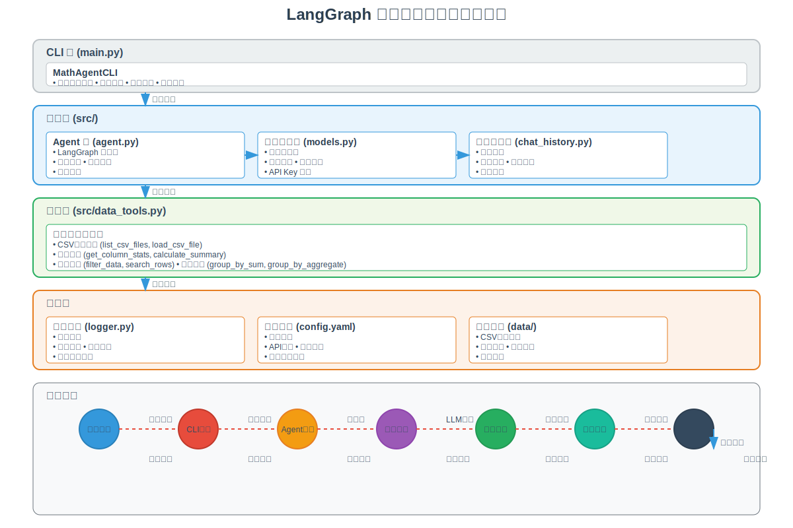
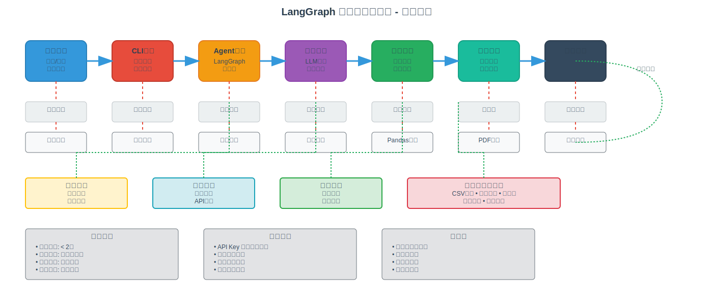
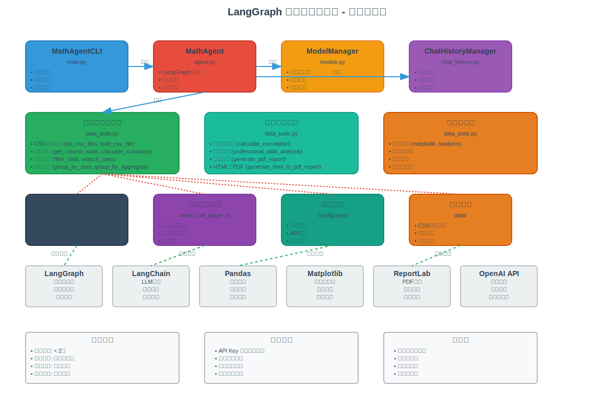

# LangGraph 数据分析智能体

基于 LangGraph 0.2.x 构建的数据分析智能体，支持流式对话、多模型切换和数据分析工具调用。

## 功能特性

- 🤖 支持多种大模型：DeepSeek、GLM、Kimi
- 📊 内置数据分析工具：CSV文件分析、统计分析、数据筛选
- 💬 流式对话体验
- 📝 会话历史记录
- 🔄 运行时模型切换
- 🖥️ 命令行交互界面

## 快速开始

### 1. 安装依赖

```bash
pip install -r requirements.txt
```

### 2. 配置环境变量

**⚠️ 安全配置说明：**

1. **复制环境变量模板：**
```bash
cp .env.example .env
```

2. **编辑 `.env` 文件，填入你的 API Keys：**
```bash
# 编辑 .env 文件
DEEPSEEK_API_KEY=your-deepseek-api-key-here
GLM_API_KEY=your-glm-api-key-here
KIMI_API_KEY=your-kimi-api-key-here
```

3. **复制配置文件模板：**
```bash
cp config/config.yaml.example config/config.yaml
```

**🔒 安全注意事项：**
- **永远不要**将真实的 API Keys 提交到 Git 仓库
- `.env` 和 `config/config.yaml` 文件已被添加到 `.gitignore`
- 使用环境变量管理敏感信息
- 定期轮换 API Keys

### 3. 运行程序

```bash
python main.py
```

## 使用说明

### 启动时选择模型

程序启动后会提示选择模型：
- `1` - DeepSeek
- `2` - GLM (智谱AI)  
- `3` - Kimi

### 特殊命令

- `/switch <model>` - 切换模型（deepseek/glm/kimi）
- `/history` - 查看会话历史
- `/clear` - 清除当前会话历史
- `/exit` 或 `/quit` - 退出程序

### 数据分析示例

```
用户: 分析 sales.csv 文件中的销售数据
智能体: 我来帮你分析销售数据，首先查看文件结构...

用户: 计算每个月的销售总额
智能体: 根据数据计算，各月销售总额如下...
```

## 项目架构

### 系统架构图



**架构说明：**
- **CLI 层**：用户交互界面，负责命令处理和流式对话
- **核心层**：Agent 状态图管理、模型管理、会话历史管理
- **工具层**：15+ 个专业数据分析工具，支持 CSV 操作、统计分析、报告生成
- **支持层**：日志系统、配置管理、数据存储

### 数据流图



**数据流说明：**
- **主流程**：用户输入 → CLI界面 → Agent处理 → 模型推理 → 工具调用 → 数据分析 → 结果返回
- **处理逻辑**：输入验证 → 命令解析 → 状态管理 → 工具选择 → 安全检查 → 数据处理
- **数据管理**：历史记录 → 会话管理 → 模型调用 → Pandas处理 → 报告生成 → 实时反馈
- **支持系统**：日志记录、配置管理、数据存储、工具集管理
- **性能特性**：响应时间 < 2秒、并发处理、内存管理、错误恢复

### 组件关系图



**组件说明：**
- **核心组件**：MathAgentCLI、MathAgent、ModelManager、ChatHistoryManager
- **工具组件**：数据分析工具集、专业分析工具、可视化工具
- **支持组件**：日志系统、模型调用日志、配置管理、数据存储
- **外部依赖**：LangGraph、LangChain、Pandas、Matplotlib、ReportLab、OpenAI API

## 项目结构

```
langgraph-math-agent/
├── requirements.txt          # 项目依赖
├── .env.example             # 环境变量模板
├── .gitignore               # Git 忽略文件（包含敏感文件）
├── README.md                # 项目说明文档
├── docs/                    # 文档目录
│   ├── architecture.svg     # 系统架构图
│   ├── dataflow.svg         # 数据流图
│   └── components.svg       # 组件关系图
├── config/
│   ├── config.yaml.example # 配置文件模板
│   └── logging.yaml         # 日志配置文件
├── data/                    # 数据文件目录
├── chat_history/           # 会话历史存储（Git 忽略）
├── logs/                   # 日志文件目录（Git 忽略）
├── src/
│   ├── __init__.py
│   ├── agent.py             # LangGraph Agent 核心逻辑
│   ├── models.py            # 模型管理和切换
│   ├── chat_history.py     # 会话历史管理
│   ├── data_tools.py        # 数据分析工具定义
│   ├── tools.py             # 工具模块（已清空）
│   ├── logger.py            # 日志记录系统
│   └── model_call_logger.py # 模型调用日志记录
└── main.py                  # CLI 主入口
```

**🔒 安全文件说明：**
- `.env` - 环境变量文件（包含 API Keys，不提交到 Git）
- `config/config.yaml` - 配置文件（包含 API Keys，不提交到 Git）
- `chat_history/*.json` - 会话历史文件（可能包含敏感信息，不提交到 Git）
- `logs/*.log` - 日志文件（可能包含 API 调用记录，不提交到 Git）

## 核心代码详解

### 1. Agent 核心逻辑 (`src/agent.py`)

**MathAgent 类**是整个系统的核心，基于 LangGraph 构建：

```python
class MathAgent:
    def __init__(self, model_manager, history_manager):
        self.tools = [数据分析工具列表]
        self.graph = self._build_graph()  # 构建状态图
    
    def _build_graph(self) -> StateGraph:
        # 定义状态类型
        class AgentState(TypedDict):
            messages: Annotated[List[BaseMessage], "消息列表"]
        
        # 创建状态图
        graph = StateGraph(AgentState)
        graph.add_node("agent", self._agent_node)    # 智能体节点
        graph.add_node("tools", self.tool_node)      # 工具节点
        graph.add_conditional_edges("agent", self._should_continue, {
            "continue": "tools",  # 需要工具调用
            "end": END            # 直接回复
        })
```

**关键特性：**
- **状态图管理**：使用 LangGraph 的 StateGraph 管理对话状态
- **工具调用**：支持动态工具选择和执行
- **流式处理**：实时输出响应内容
- **日志记录**：完整的调用链路追踪

### 2. 模型管理 (`src/models.py`)

**ModelManager 类**统一管理多个大模型：

```python
class ModelManager:
    def switch_model(self, model_name: str) -> ChatOpenAI:
        # 支持 DeepSeek、GLM、Kimi 三种模型
        llm = ChatOpenAI(
            model=model_config['name'],
            base_url=model_config['base_url'],
            api_key=api_key,
            streaming=True  # 启用流式输出
        )
```

**功能特性：**
- **多模型支持**：DeepSeek、GLM、Kimi
- **动态切换**：运行时切换模型
- **配置管理**：YAML 配置文件管理
- **API Key 管理**：环境变量和配置文件双重支持

### 3. 数据分析工具 (`src/data_tools.py`)

**工具集包含 15+ 个数据分析函数：**

```python
# 基础数据操作
@tool
def list_csv_files() -> str:
    """查看data文件夹中可用的CSV文件"""

@tool  
def load_csv_file(filename: str) -> str:
    """加载CSV文件并查看基本信息"""

# 统计分析
@tool
def get_column_stats(filename: str, column_name: str) -> str:
    """获取数值列的统计信息"""

# 专业分析
@tool
def professional_data_analysis(filename: str, analysis_type: str) -> str:
    """专业数据分析工具，支持IPTV业务分析、趋势分析等"""

# 报告生成
@tool
def generate_pdf_report(filename: str, output_dir: str, report_title: str) -> str:
    """生成PDF格式的数据分析报告"""
```

**工具分类：**
- **文件操作**：list_csv_files, load_csv_file
- **统计分析**：get_column_stats, calculate_summary
- **数据筛选**：filter_data, search_rows
- **聚合分析**：group_by_sum, group_by_aggregate
- **专业分析**：professional_data_analysis
- **报告生成**：generate_pdf_report, generate_html_to_pdf_report

### 4. 会话历史管理 (`src/chat_history.py`)

**ChatHistoryManager 类**管理对话历史：

```python
class ChatHistoryManager:
    def create_session(self) -> str:
        """创建新会话，返回会话ID"""
    
    def add_message(self, role: str, content: str):
        """添加消息到当前会话"""
    
    def save_session(self) -> bool:
        """保存会话到JSON文件"""
```

**功能特性：**
- **会话管理**：创建、加载、保存会话
- **历史存储**：JSON 格式持久化存储
- **消息管理**：用户、助手消息分类存储
- **会话恢复**：支持历史会话恢复

### 5. 日志系统 (`src/logger.py` + `src/model_call_logger.py`)

**双层日志系统：**

```python
# 通用日志记录
class LoggerManager:
    def get_logger(self, name: str) -> logging.Logger:
        """获取指定模块的日志记录器"""

# 模型调用专用日志
class ModelCallLogger:
    def log_model_call_start(self, model_name: str, session_id: str):
        """记录模型调用开始"""
    
    def log_tool_execution_start(self, tool_name: str, tool_args: dict):
        """记录工具执行开始"""
```

**日志类型：**
- **性能日志**：执行时间、资源使用
- **调用日志**：模型调用详情
- **工具日志**：工具执行记录
- **错误日志**：异常和错误追踪

### 6. CLI 界面 (`main.py`)

**MathAgentCLI 类**提供命令行交互：

```python
class MathAgentCLI:
    def select_model(self) -> str:
        """模型选择界面"""
    
    def chat_loop(self):
        """主对话循环"""
        while True:
            user_input = input("👤 你: ")
            # 流式输出响应
            for chunk in self.agent.chat_stream(user_input):
                print(chunk, end="", flush=True)
```

**交互特性：**
- **模型选择**：启动时选择模型
- **命令处理**：/switch, /history, /clear 等命令
- **流式输出**：实时显示响应内容
- **错误处理**：友好的错误提示

## 技术栈

- **LangGraph 0.2.x** - 智能体框架，状态图管理
- **LangChain 0.3.x** - LLM 集成，工具调用
- **Pandas** - 数据处理和分析
- **Matplotlib/Seaborn** - 数据可视化
- **ReportLab/WeasyPrint** - PDF 报告生成
- **OpenAI 兼容接口** - 统一模型调用
- **Python 3.8+** - 运行环境

## 工作流程

### 1. 系统启动流程

```
启动程序 → 加载配置 → 选择模型 → 初始化Agent → 开始对话
    ↓         ↓         ↓         ↓         ↓
  CLI界面   配置文件   模型管理   LangGraph  用户交互
```

### 2. 对话处理流程

```
用户输入 → 命令判断 → 历史管理 → Agent处理 → 模型推理 → 工具调用 → 结果返回
    ↓         ↓         ↓         ↓         ↓         ↓         ↓
  输入验证   特殊命令   会话管理   状态图     LLM调用   工具执行   流式输出
```

### 3. 数据分析流程

```
数据请求 → 文件验证 → 数据加载 → 分析处理 → 结果生成 → 报告输出
    ↓         ↓         ↓         ↓         ↓         ↓
  工具选择   安全检查   Pandas处理  统计分析   可视化     PDF生成
```

## 扩展开发

### 添加新的数据分析工具

1. **在 `src/data_tools.py` 中定义新工具：**

```python
@tool
def your_new_tool(param1: str, param2: int) -> str:
    """
    新工具的描述
    
    Args:
        param1: 参数1描述
        param2: 参数2描述
        
    Returns:
        工具执行结果
    """
    # 工具实现逻辑
    return "执行结果"
```

2. **在 `src/agent.py` 中注册工具：**

```python
self.tools = [
    # 现有工具...
    your_new_tool,  # 添加新工具
]
```

3. **更新系统提示：**

在 `agent.py` 的 `system_prompt` 中添加新工具的描述。

### 添加新的模型支持

1. **在 `config/config.yaml` 中添加模型配置：**

```yaml
models:
  your_model:
    name: "model-name"
    base_url: "https://api.example.com/v1"
    api_key_env: "YOUR_MODEL_API_KEY"
    temperature: 0.7
    max_tokens: 2000
```

2. **在 `main.py` 中更新模型选择逻辑：**

```python
def select_model(self) -> str:
    print("4. Your Model")
    # 更新选择逻辑
```

### 自定义日志记录

1. **扩展 `ModelCallLogger` 类：**

```python
def log_custom_event(self, event_type: str, data: dict):
    """记录自定义事件"""
    # 实现自定义日志逻辑
```

2. **在工具中使用：**

```python
from .model_call_logger import model_call_logger

# 在工具函数中记录日志
model_call_logger.log_custom_event("data_analysis", {"file": filename})
```

## 性能优化

### 1. 内存管理
- 大数据文件分块处理
- 及时释放 DataFrame 内存
- 使用生成器处理大文件

### 2. 并发处理
- 异步工具调用
- 并行数据分析
- 缓存机制

### 3. 错误处理
- 优雅降级
- 重试机制
- 错误恢复

## 部署建议

### 1. 生产环境配置
```yaml
# config/config.yaml
app:
  auto_use_default: true
  show_model_selection: false

data_analysis:
  max_file_size_mb: 100
  max_rows_display: 1000
```

### 2. 日志配置
```yaml
# config/logging.yaml
version: 1
handlers:
  file:
    class: logging.handlers.RotatingFileHandler
    maxBytes: 10485760  # 10MB
    backupCount: 5
```

### 3. 安全考虑
- API Key 环境变量管理
- 文件路径验证
- 输入参数校验
- 资源使用限制
